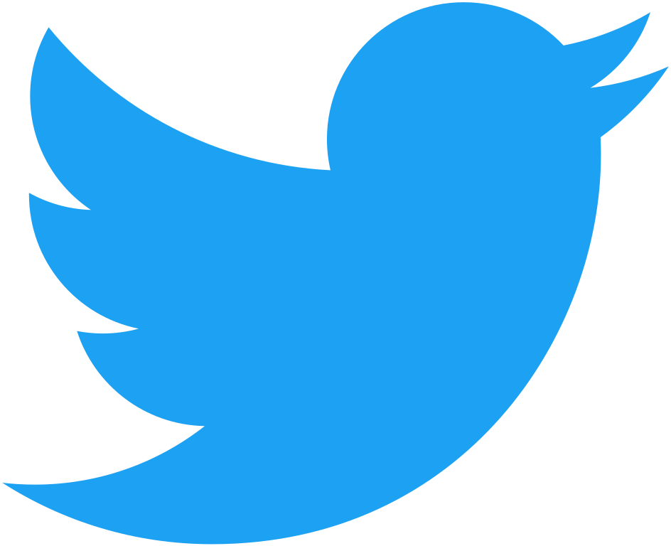

# Adam Li, PhD

 

Hi there! I'm Adam, a postdoctoral research scientist at Columbia University in the Causal AI Lab. I am a Computing Innovation Research Fellow funded by the NSF. I am working at the intersection of neuroscience and causal inference.

- [Personal Website](http://adam2392.github.io)

# Employment

## [Postdoctoral Research Scientist, Columbia University in the Causal AI Lab](https://github.com/adam2392/adam2392/blob/master/causalailab.md)
*2022-Present*

__Executive Summary__
<!-- remember to update corresponding page -->
At the Causal AI Lab, I am a Computing Innovation Research Fellow funded by the NSF. I am working at the intersection of neuroscience and causal inference.

My causal inference research interests are in structure learning and causal estimation in equivalence classes and their relations to neuroscience. More broadly,
I develop theoretically grounded neural networks capable of understanding the causal relationships between latent factors within images, or text.

## [PhD Candidate, Johns Hopkins University in the Neuromedical Control Systems Lab](https://github.com/adam2392/adam2392/blob/master/phd.md)
*2015-2022*

__Executive Summary__
<!-- remember to update corresponding page -->
At Johns Hopkins University, I was a NSF Graduate Research Fellow, Whitaker Fellow, Chateaubriand Fellow and ARCS Chapter Scholar. My research interests were in computational neuroscience, epilepsy, statistical machine learning, dynamical systems and control theory.

# Skills

- Python Expert
- MATLAB Expert
- Cython and C++ Proficient
- R Beginner

# Open-Source Summary

I am a core-contributor to scikit-learn, Py-Why, MNE-Python, MNE-BIDS, MNE-Connectivity and contributed to other packages, such as pyDMD, TVB.

